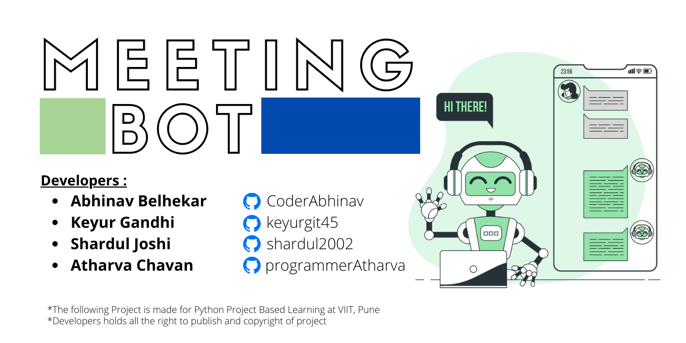

## [About](#about-the-project)

## [Developers](#developed-by)

## [How to use](#to-run-the-program)

# About The Project
This is a simple bot which automatically log you in to your scheduled 
meeting. So there will be no more hassle for you to join any meeting
This Project is made by students of First Year Computer Engineering at
Vishwakarma Institute Of Information Technology, Pune
(http://www.viit.ac.in)

# Developed By 
Abhinav Belhekar  [CoderAbhinav](https://github.com/CoderAbhinav)

Keyur Gandhi     (https://github.com/keyurgit45  )

Shardul Joshi    (https://github.com/shardul2002)

Atharva Chavan   (https://github.com/programmerAtharva)

# To run the program 
## step 1
Go throght readme.txt
## step 2
pip3 install -r requirements.txt
## step 3
python3 main.py

